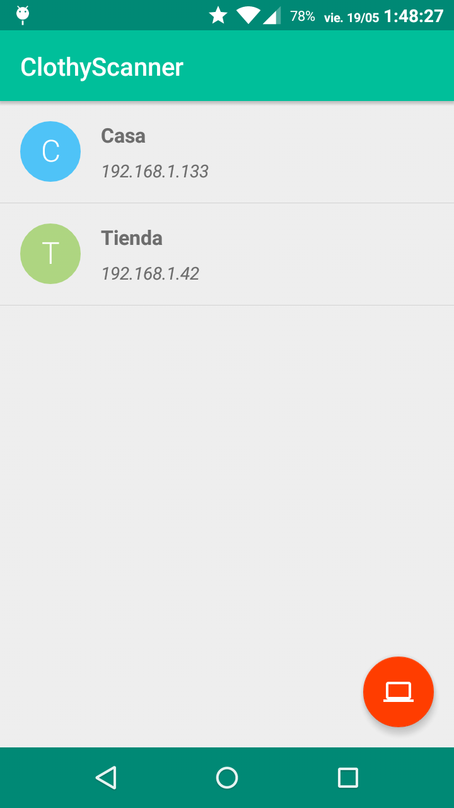
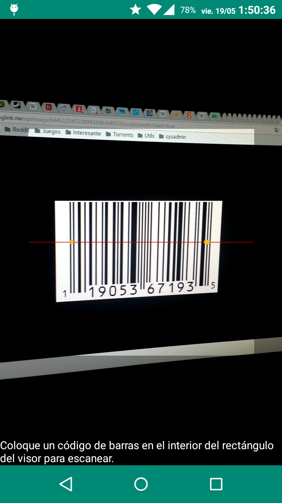

# ClothyScanner
App to send barcode data to an UDP server. This project has been created for fun and quickly to help the following project: [https://github.com/legomolina/Clothy-app](https://github.com/legomolina/Clothy-app).

# Images

